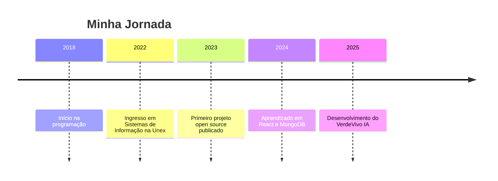

  
  <h1>Matheus Santos</h1>
  

    <b>Desenvolvedor Full Stack | Estudante de Sistemas de Informação</b> 
    <a href="https://unex.edu.br">Unex</a> • Brasil
  

---

## 🧑‍💻 Sobre Mim

- 👨‍🎓 26 anos, apaixonado por tecnologia e inovação.
- 🎯 Foco em desenvolvimento web, automação e IA.
- 🌱 Sempre aprendendo e compartilhando conhecimento.
- 💬 Gosto de ajudar e trocar ideias sobre programação!

---

## 🚀 Minhas Skills

**Linguagens de Programação:**  

**Linguagens de Marcação & Estilo:**  

**Banco de Dados:**  

**Ferramentas:**  

**Sistema Operacional:**  

---

## 📚 Linha do Tempo

---

## 🌟 Projetos em Destaque

- [**VerdeVivo IA**](https://github.com/matheusesdev/verde-ai)  
  Rede social para amantes de plantas, com dicas, identificação e conquistas.

- [**Portfolio Pessoal**](https://github.com/matheusesdev/portfolio)  
  Site pessoal com projetos, blog e contato.

- [**Automação de Tarefas com Python**](https://github.com/matheusesdev/automacoes)  
  Scripts para facilitar o dia a dia.

---

## 📈 Estatísticas do GitHub

  
  

---

## 📬 Contato & Redes

  
  
  
  
  

---

## 💬 Curiosidades

- 🏆 Participante ativo de comunidades de tecnologia.
- 📖 Gosto de estudar sobre IA, automação e design.
- 🎮 Gamer nas horas vagas.

---

## ✨ Frase que me inspira

> _“A tecnologia move o mundo.”_ — Steve Jobs

---

  Feito com ❤️ por Matheus Santos

